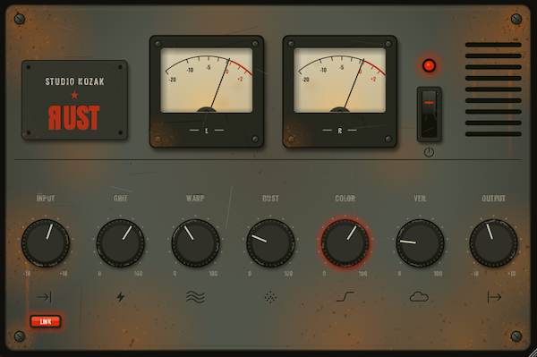

  

<h1 align="center">SK RUST</h1>

  <em>The sound of something forgotten in a damp Eastern European cellar.</em>

  

  <strong>
    <a href="https://github.com/studiokozak/SK-Rust/releases/latest">
      Download Latest Release
    </a>
  </strong>

---

## Overview

Let's be honest: the world does not need another lo-fi plugin. There are already plenty, and many of them are excellent
**SK Rust** is one more. It degrades, corrodes and dirties a clean signal until it sounds worn, dusty and vaguely remembered.
Try it anyway, if you feel like it. Maybe it'll find a place in your music. Maybe it won't, and you'll forget all about it ... it's a rusty old thing, and rusty old things are made to be left behind.

---

## Features

* Multi-stage lo-fi coloration engine
* Saturation and harmonic grit
* Tonal shaping voiced for degraded textures
* Fractal instability / wobble
* Noise, dust and hiss layer
* Combined atmosphere / veil processing
* Input/Output linked gain staging
* Stereo VU metering
* 2× oversampled processing
* VST3 (Windows & macOS)
* Audio Unit (macOS)
* Intel & Apple Silicon support

---

## Controls

### INPUT
Sets the level feeding the coloration stage. Higher settings push the signal harder into the dirt.

---

### GRIT
Controls saturation and harmonic distortion. From a gentle warmth to a broken, overdriven crust.

---

### WARP
Introduces instability and movement. The wobble and drift of tired and imperfect hardware.

---

### DUST
Adds noise, hiss and dust. At zero, the noise floor is truly silent; turn it up to bury the signal in grain and debris.

---

### COLOR
Shapes the overall tone of the degraded signal, from dark and muffled to thin and brittle.

---

### VEIL
A combined atmosphere control that softens and hazes the signal. It's a veil of mist, shade and fade laid over the sound. Adds distance and murk without echo or slapback.

---

### OUTPUT
Adjusts the final output level and can be used to compensate for the gain changes introduced by the coloration stage.

---

### LINK
Links the INPUT and OUTPUT controls. When enabled, increasing the input level automatically applies an opposite compensation to the output level, making it easier to explore the coloration stage and compare different amounts of dirt without large changes in perceived loudness.

---

### VU Meters
Provide visual feedback on the output level while driving the coloration stage.

---

### POWER
Engages or bypasses the processing.

---

## Philosophy

SK Rust does not include any presets, and it does not offer a preset browser or a factory library to scroll through.
This is a deliberate choice. The plugin only has a handful of controls, and they are few enough that presets would add complexity where none is needed.
The idea is simple: turn the controls, listen to what happens, and trust your ears.

---

## Typical Applications

SK Rust tends to shine on sustained, legato harmonic material with long held notes where its texture has room to breathe:

* Pads and synth drones
* Strings and bowed instruments
* Flutes and woodwinds
* Vocals and choirs
* Clean and acoustic guitars
* Reverb returns and tails

It is usually less at home on drums and percussion. Though nothing stops you from trying, and the results can be interesting.
On a full mix it is best avoided, unless that heavy and unmistakable lo-fi character is exactly what you are after.

---

## System Requirements

### Windows
* Windows 10 or later
* VST3 compatible host
* VST3 format

### macOS
* macOS 11 Big Sur or later
* Intel or Apple Silicon
* VST3 and Audio Unit (AU) formats
* Compatible VST3 or Audio Unit host

---

## Installation

### Windows
Copy:
`SK Rust.vst3`
to:
`C:\Program Files\Common Files\VST3`

Then restart your DAW.

### macOS

#### VST3 Version
Copy:
`SK Rust.vst3`
to:
`/Library/Audio/Plug-Ins/VST3`

#### Audio Unit Version
Copy:
`SK Rust.component`
to:
`/Library/Audio/Plug-Ins/Components`

Then restart your DAW.

---

### macOS Security
SK Rust is built as a Universal Binary and supports both Intel and Apple Silicon Macs.
Depending on your macOS security settings, you may need to authorize the plugin manually the first time it is loaded.

---
I hope you enjoy SK Rust.

*Stéphan (Studio Kozak)*
